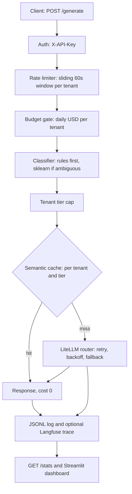

# Arbiter

**An LLM gateway that routes every request to the cheapest model that can handle it** — with multi-provider fallback, per-tenant budgets and rate limits, a semantic cache, and request-level cost telemetry.

[](https://arbiter-dzrv.onrender.com/health) · free tier: the first request after 15 idle minutes takes ~20-30s to wake (18s measured).

## Architecture



| Tier | Primary model | Fallback |
|---|---|---|
| simple | Groq `gpt-oss-20b` | none |
| standard | Gemini `3.1-flash-lite` | Groq `gpt-oss-120b` |
| complex | Groq `qwen3.8-27b` | Groq `gpt-oss-120b` |

Embeddings for the cache: Gemini `gemini-embedding-001`. Model names **and prices** live in `config/litellm_config.yaml` (the app refuses to start if a model has no pricing); the tier-to-fallback-chain mapping is in `src/arbiter/router.py`.

## Key results

40 benchmark tasks (15 simple / 15 standard / 10 complex), each run once through the all-premium baseline (every task on the tier-3 model, no fallback) and once through the gateway, then scored 1-5 by an LLM judge (rubric v2, A/B order randomised). Costs are estimated at list prices. The classifier is trained on a **separate** 60-example set that shares no prompt with the benchmark (checked by `scripts/validate_benchmark.py`), so routing accuracy is held-out. Full report with the confusion matrix and run metadata: [`reports/EVAL_REPORT.md`](reports/EVAL_REPORT.md).

| Metric | Value |
|---|---|
| Routing accuracy, held-out (assigned tier = expected tier) | **80.0%** (macro precision 0.78, recall 0.79, F1 0.78) |
| Cost savings vs all-premium | **37.8%** ($0.0467 to $0.0290) |
| Cost savings excluding the 4 fallback tasks | 23.7% |
| Quality retention (routed score >= baseline - 0.5) | **97.5%** |
| Routed answers meeting each task's quality bar | 100% |
| Fallback rate | 10% (4 of 40) |
| Latency p50 / p95, baseline | 349 ms / 12.8 s |
| Latency p50 / p95, routed | 3.1 s / 22.1 s |

| Expected tier | Routing accuracy | Savings |
|---|---|---|
| simple | 100% | 82.6% |
| standard | 67% | 42.7% |
| complex | 70% | 33.1% |

Routing confusion matrix (rows = expected, columns = assigned):

```
              Predicted
           S      M      C
Actual S [15]  [ 0]  [ 0]
Actual M [ 2]  [10]  [ 3]
Actual C [ 0]  [ 3]  [ 7]
```

An earlier run reported 82.5% routing accuracy, but the classifier had been trained on the benchmark prompts themselves, so that number was inflated. After separating the training data the honest figure is 80.0%. Read all of these with the limitations below. The latency columns are not like-for-like: the baseline was measured in an earlier session, and routed latency includes the embedding call and any retry backoff on rate-limited free-tier providers.

## Run locally

```bash
git clone https://github.com/Som0111/arbiter.git && cd arbiter
python -m venv .venv && source .venv/bin/activate   # Windows: .venv\Scripts\activate
make install                                        # pip install -e ".[dev]"
cp .env.template .env                               # fill in GROQ_API_KEY, GEMINI_API_KEY, ARBITER_API_KEY
make run                                            # API on http://localhost:8000
make dashboard                                      # Streamlit on http://localhost:8501 (second terminal)
make test && make lint
python scripts/validate_benchmark.py                 # benchmark schema + no train/benchmark leakage
python scripts/train_classifier.py                   # retrain on data/classifier_train.json, prints CV precision/recall
python scripts/run_eval.py                          # full eval (~30 min on free tiers; --resume to continue, --report-only to rebuild the report)
```

## API

All endpoints except `/health` need an `X-API-Key` header equal to `ARBITER_API_KEY`.

**`GET /health`** → `{"status": "ok", "version": "0.1.0", "uptime_seconds": 12, "tenant_count": 3}`

**`POST /generate`**

```bash
curl -X POST https://arbiter-dzrv.onrender.com/generate \
  -H "X-API-Key: $ARBITER_API_KEY" -H "Content-Type: application/json" \
  -d '{"prompt": "What is the capital of France?", "tenant_id": "tenant_test", "max_tokens": 200}'
```

```json
{"response": "The capital of France is **Paris**.", "model_used": "groq/openai/gpt-oss-20b",
 "tier": "simple", "tokens_in": 78, "tokens_out": 40, "cost_usd": 0.00001785,
 "latency_ms": 1425.9, "cache_hit": false, "fallback_triggered": false, "request_id": "req_d2c1bbfadd22"}
```

Request fields: `prompt` (required), `tenant_id` (required), `max_tokens` (1-8192, default 512), `priority` (`low`/`standard`/`high`), `task_type` (optional hint, currently unused).
Errors: `401` bad key · `404` `{"error": "unknown_tenant"}` · `422` invalid body · `429` `{"error": "rate_limited"}` or `{"error": "budget_exceeded"}` · `503` `{"error": "all_models_exhausted"}`.

**`GET /stats`** → aggregates over the JSONL log: request count, total cost, cache hit rate, estimated saved USD, fallback rate, tier distribution, cost by tenant and tier, p50/p95 latency, requests in the last 24h, cache size, cache max size and total LRU evictions.

Tenants (budget, tier cap, rate limit) are defined in `config/tenants.yaml`.

## Design decisions

**Rules before sklearn.** Four cheap, high-precision rules (very short prompt, very long prompt, code/debug keywords, simple-task keywords) decide the clear cases in microseconds at zero cost. Only ambiguous prompts reach a small logistic regression. Calling an LLM to pick an LLM would add latency and cost to every request, and with 60 labelled examples a bigger model would just overfit.

**Cache keyed by (tenant, tier).** A cached answer is only served inside the same tenant and the same tier. This prevents cross-tenant data leaks and means a cache hit never contradicts the routing decision that was logged. Cache hits log `cost_usd = 0` and record the avoided cost in `saved_usd`, so `/stats` can report savings.

**One source of truth for pricing.** Model names and per-token prices live together in `config/litellm_config.yaml`, and `router.py` computes every request's cost from that file (LiteLLM's own price table isn't consulted, since it doesn't know every model and can lag behind releases). The file is validated when the app starts: a model with missing or invalid pricing stops startup with a clear error instead of silently costing $0 at request time.

## Honest limitations

1. **Single process, in-memory state.** Rate limits, budgets and the cache live in the process. They reset on restart and do not work across multiple instances (needs Redis).
2. **Free-tier quotas.** On this key Gemini allows about 15 requests/day per model and Groq about 8k tokens/minute. Standard requests fall back to Groq once Gemini's quota is gone, so a busy live service mostly runs on Groq.
3. **Small, weak classifier.** It is trained on 60 hand-written examples; cross-validated accuracy is 70.0%. On the held-out benchmark 8 of 40 tasks were misrouted (for example, standard tasks containing code or the word "summarize" go to the wrong tier).
4. **The eval is small and the judge is generous.** One run of 40 tasks. The judge (`gpt-oss-120b`) is also the fallback model and shares a family with tier 1, and even with the stricter rubric it scores everything about 4.9 on average, so quality retention is a loose measure. Treat 37.8% and 97.5% as indicative, not precise.
5. **Fallbacks flatter the savings.** Four routed requests (m013, c003, c006, c010) were answered by `gpt-oss-120b` after the primary model was rate-limited. That model is cheaper than the Qwen baseline, so excluding those tasks the saving drops from 37.8% to 23.7%.

## Failure modes

1. **Render cold start.** The free tier sleeps after 15 idle minutes; the first request takes ~20-30s (18s measured on this deploy). Mitigation: a keep-alive ping, or a paid instance.
2. **Provider quota exhaustion.** The eval stalled twice when Gemini returned `429 GenerateRequestsPerDayPerProjectPerModel-FreeTier`. The router now treats this like any other failure and falls back to Groq.
3. **Model deprecation.** Every model in the original plan (Llama 3.1, Gemini 1.5, `text-embedding-004`) was retired or closed to new users before the build finished. Mitigation: model names live in one YAML file and the live model list should be checked before each release.
4. **Cache is bounded but per-process.** It holds at most 500 entries (global LRU eviction, hits refresh recency) plus a 1-hour TTL, and `/stats` reports size and evictions. It is still in memory, so it empties on restart and isn't shared between instances. Fix: Redis.
5. **Logs lost on restart.** `logs/requests.jsonl` is ephemeral on Render's free tier, so `/stats` resets. Fix: point `LOG_PATH` at a mounted volume or ship logs to external storage.
