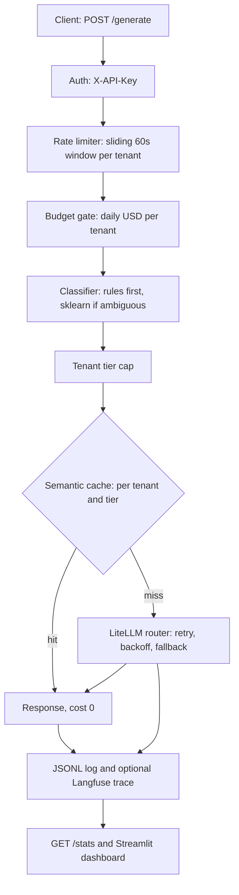

# Arbiter

**An LLM gateway that routes every request to the cheapest model that can handle it** — with multi-provider fallback, per-tenant budgets and rate limits, a semantic cache, and request-level cost telemetry.

[](https://arbiter-dzrv.onrender.com/health) · free tier: the first request after 15 idle minutes takes ~20-30s to wake (18s measured).

## Architecture



| Tier | Primary model | Fallback |
|---|---|---|
| simple | Groq `gpt-oss-20b` | none |
| standard | Gemini `3.1-flash-lite` | Groq `gpt-oss-120b` |
| complex | Groq `qwen3.8-27b` | Groq `gpt-oss-120b` |

Embeddings for the cache: Gemini `gemini-embedding-001`. The tier-to-model mapping lives in `config/litellm_config.yaml` and `src/arbiter/router.py`.

## Key results

40 benchmark tasks (15 simple / 15 standard / 10 complex), each run once through the all-premium baseline (every task on the tier-3 model) and once through the gateway, then scored 1-5 by an LLM judge. Costs are estimated at list prices. Full report: [`reports/EVAL_REPORT.md`](reports/EVAL_REPORT.md).

| Metric | Value |
|---|---|
| Cost savings vs all-premium | **40.2%** ($0.0467 to $0.0279) |
| Quality retention (routed score >= baseline - 0.5) | **90.0%** |
| Routed answers meeting each task's quality bar | 100% |
| Routing accuracy (assigned tier = expected tier) | 82.5% |
| Fallback rate | 12.5% |
| Latency p50 / p95, baseline | 349 ms / 12.8 s |
| Latency p50 / p95, routed | 1.9 s / 8.4 s |

| Expected tier | Routing accuracy | Savings |
|---|---|---|
| simple | 100% | 83.7% |
| standard | 67% | 41.9% |
| complex | 80% | 36.2% |

Read these with the limitations below: the judge shares a model family with the routed models, and 5 of the 10 complex tasks were answered by the fallback model rather than the baseline.

## Run locally

```bash
git clone https://github.com/Som0111/arbiter.git && cd arbiter
python -m venv .venv && source .venv/bin/activate   # Windows: .venv\Scripts\activate
make install                                        # pip install -e ".[dev]"
cp .env.template .env                               # fill in GROQ_API_KEY, GEMINI_API_KEY, ARBITER_API_KEY
make run                                            # API on http://localhost:8000
make dashboard                                      # Streamlit on http://localhost:8501 (second terminal)
make test && make lint
python scripts/run_eval.py                          # full eval (~30 min on free tiers; --resume to continue)
```

## API

All endpoints except `/health` need an `X-API-Key` header equal to `ARBITER_API_KEY`.

**`GET /health`** → `{"status": "ok", "version": "0.1.0", "uptime_seconds": 12, "tenant_count": 3}`

**`POST /generate`**

```bash
curl -X POST https://arbiter-dzrv.onrender.com/generate \
  -H "X-API-Key: $ARBITER_API_KEY" -H "Content-Type: application/json" \
  -d '{"prompt": "What is the capital of France?", "tenant_id": "tenant_test", "max_tokens": 200}'
```

```json
{"response": "The capital of France is **Paris**.", "model_used": "groq/openai/gpt-oss-20b",
 "tier": "simple", "tokens_in": 78, "tokens_out": 40, "cost_usd": 0.00001785,
 "latency_ms": 1425.9, "cache_hit": false, "fallback_triggered": false, "request_id": "req_d2c1bbfadd22"}
```

Request fields: `prompt` (required), `tenant_id` (required), `max_tokens` (1-8192, default 512), `priority` (`low`/`standard`/`high`), `task_type` (optional hint, currently unused).
Errors: `401` bad key · `404` `{"error": "unknown_tenant"}` · `422` invalid body · `429` `{"error": "rate_limited"}` or `{"error": "budget_exceeded"}` · `503` `{"error": "all_models_exhausted"}`.

**`GET /stats`** → aggregates over the JSONL log: request count, total cost, cache hit rate, estimated saved USD, fallback rate, tier distribution, cost by tenant and tier, p50/p95 latency, requests in the last 24h, cache size.

Tenants (budget, tier cap, rate limit) are defined in `config/tenants.yaml`.

## Design decisions

**Rules before sklearn.** Four cheap, high-precision rules (very short prompt, very long prompt, code/debug keywords, simple-task keywords) decide the clear cases in microseconds at zero cost. Only ambiguous prompts reach a small logistic regression. Calling an LLM to pick an LLM would add latency and cost to every request, and with 40 labelled examples a bigger model would just overfit.

**Cache keyed by (tenant, tier).** A cached answer is only served inside the same tenant and the same tier. This prevents cross-tenant data leaks and means a cache hit never contradicts the routing decision that was logged. Cache hits log `cost_usd = 0` and record the avoided cost in `saved_usd`, so `/stats` can report savings.

**Deterministic cost map as a fallback.** LiteLLM's price table is used first, but it doesn't know every model (it raised `ModelNotMapped` for the Groq-hosted Qwen model) and it can lag behind releases. A manual per-token map in `router.py` guarantees every request gets a cost, so budgets and the dashboard never silently see `$0`.

## Honest limitations

1. **Single process, in-memory state.** Rate limits, budgets and the cache live in the process. They reset on restart and do not work across multiple instances (needs Redis).
2. **Free-tier quotas.** On this key Gemini allows about 15 requests/day per model and Groq about 8k tokens/minute. Standard requests fall back to Groq once Gemini's quota is gone, so a busy live service mostly runs on Groq.
3. **Classifier trained on 40 examples.** Cross-validated accuracy is 72.5%. On the benchmark, 7 of 40 tasks were misrouted (for example, standard tasks containing code or the word "summarize").
4. **The eval is small and the judge is generous.** One run of 40 tasks; the judge (`gpt-oss-120b`) is the fallback model and shares a family with tier 1, and it scores everything 4.6-4.8 on average. Treat 40.2% and 90% as indicative.
5. **The baseline is partly the fallback.** Five complex tasks (c006-c010) were answered by `gpt-oss-120b` after the baseline-tier model hit rate limits, so the complex-tier savings compare 120b to Qwen rather than pure routing.

## Failure modes

1. **Render cold start.** The free tier sleeps after 15 idle minutes; the first request takes ~20-30s (18s measured on this deploy). Mitigation: a keep-alive ping, or a paid instance.
2. **Provider quota exhaustion.** The eval stalled twice when Gemini returned `429 GenerateRequestsPerDayPerProjectPerModel-FreeTier`. The router now treats this like any other failure and falls back to Groq.
3. **Model deprecation.** Every model in the original plan (Llama 3.1, Gemini 1.5, `text-embedding-004`) was retired or closed to new users before the build finished. Mitigation: model names live in one YAML file and the live model list should be checked before each release.
4. **Unbounded cache.** Entries expire after an hour but there is no size cap; a long-lived instance with many distinct prompts grows without limit. Fix: add `max_size` with LRU eviction.
5. **Logs lost on restart.** `logs/requests.jsonl` is ephemeral on Render's free tier, so `/stats` resets. Fix: point `LOG_PATH` at a mounted volume or ship logs to external storage.
